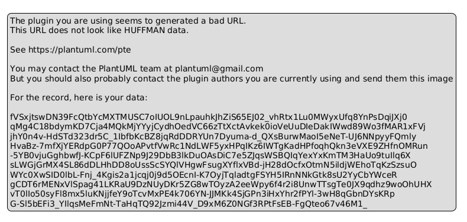
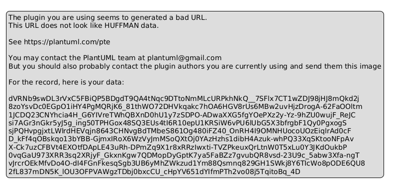
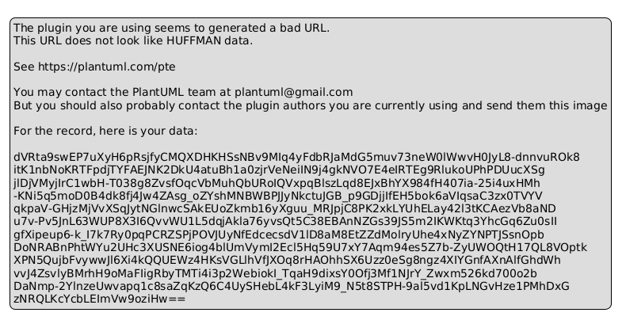
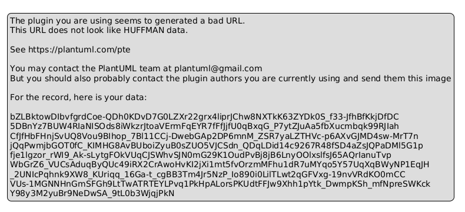

# Archon UML Documentation

This directory contains comprehensive UML 2.5 documentation for the Archon project.

## Directory Structure

- `class-diagrams/` - Class diagrams showing the static structure
- `sequence-diagrams/` - Sequence diagrams showing object interactions
- `activity-diagrams/` - Activity diagrams showing workflow processes
- `component-diagrams/` - Component diagrams showing system architecture
- `state-diagrams/` - State diagrams showing conversation flow

## UML 2.5 Standards

All diagrams follow UML 2.5 standards and are created using PlantUML notation for version control friendliness and easy updates.

## Viewing Diagrams

The diagrams are provided in both PlantUML (.puml) format and exported images (.png) for easy viewing.

## Generated Diagrams

### Agent Creation Flow

### Conversation Flow

### Core Components

### System Architecture

### Workflow Process

